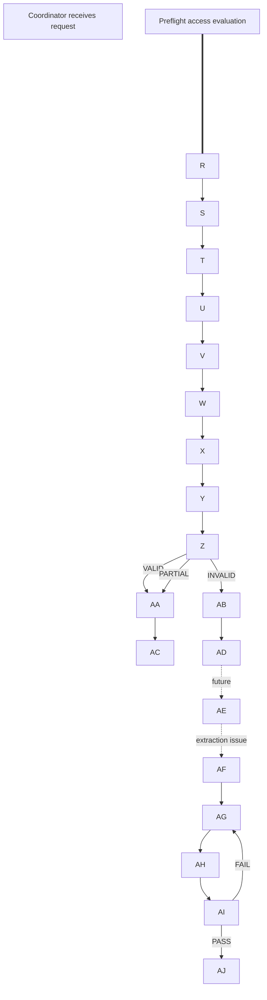
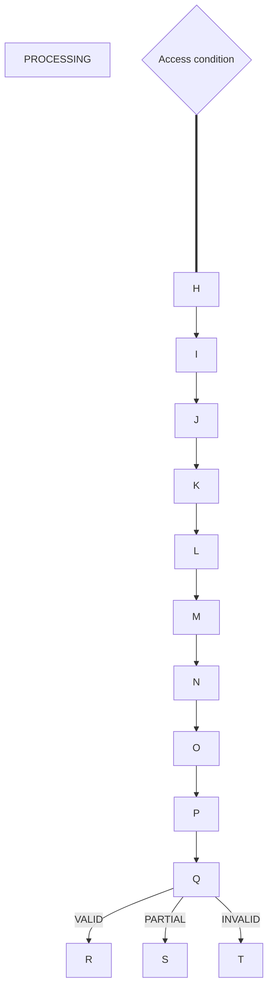
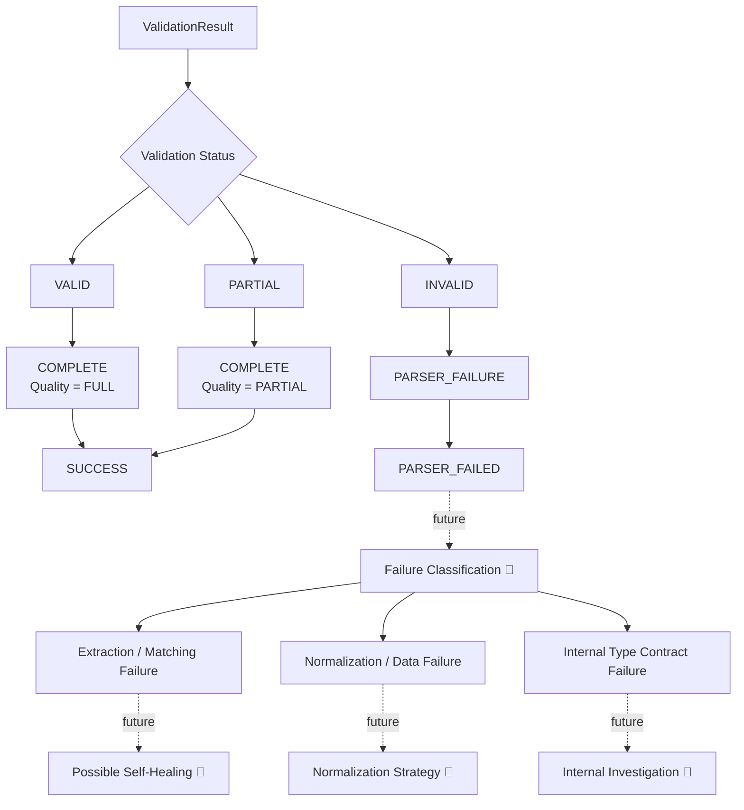
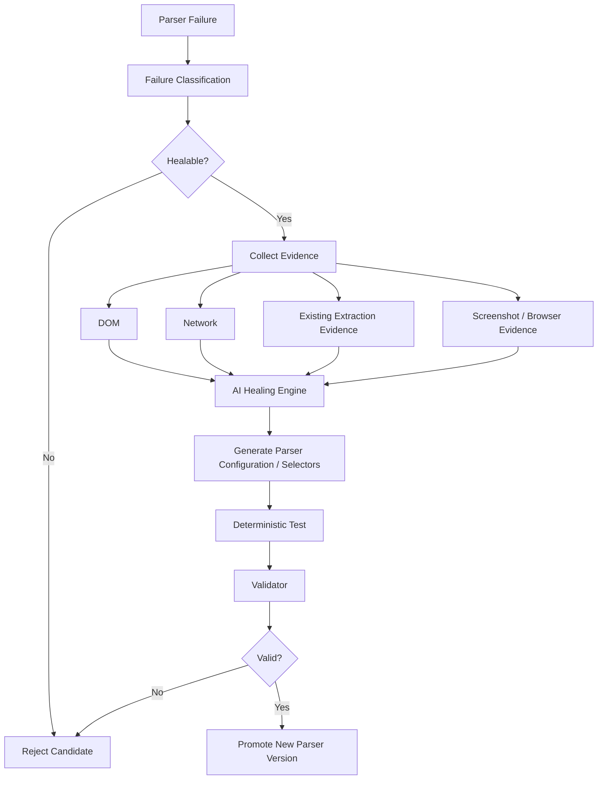

<<<<<<< HEAD
# Agentic Loop – Universal Self-Healing Web Scraper

Agentic Loop is a **universal, adaptive web scraping engine** designed to scrape different websites and dynamically extract whatever fields the user requests.

The long-term goal is to build a scraper that can detect extraction failures, adapt to website changes, validate fixes, and eventually **self-heal automatically**.

## What I Am Building

The intended flow is:
=======
# Agentic Loop – Universal Adaptive Web Scraping Engine

Agentic Loop is a **universal, adaptive web scraping engine** built to scrape different websites and dynamically extract whatever fields the user requests.

The project is designed around a deterministic scraping pipeline first, with a future self-healing layer that can detect extraction failures, classify them, generate safer parser changes, validate those changes, and promote working configurations.

> Self-healing and AI-based repair are planned capabilities. The current implementation focuses on a reliable crawling, access-control, extraction, matching, normalization, and validation foundation.

---

## What I Am Building

The complete target flow is:
>>>>>>> 9abfc52 (feat: complete deterministic universal parser pipeline)

```text
Agent Request
    ↓
<<<<<<< HEAD
Scrape Job
    ↓
Crawler
    ↓
Access Control
    ↓
Fetcher
=======
ScrapeJob + RequestedField[]
    ↓
RequestManager
    ↓
Crawler
    ↓
AccessController
    ↓
FastFetcher
    ↓
FetchEnvelope
>>>>>>> 9abfc52 (feat: complete deterministic universal parser pipeline)
    ↓
Structured Data Extraction
    ↓
Field Matching
    ↓
<<<<<<< HEAD
Validation
    ↓
Self-Healing if extraction fails
=======
Field Resolution
    ↓
Normalization
    ↓
Validation
    ↓
Parser Outcome Policy
    ↓
SUCCESS / PARSER_FAILED
    ↓
Future Failure Classification
    ↓
Future Self-Healing
>>>>>>> 9abfc52 (feat: complete deterministic universal parser pipeline)
```

The scraper is designed to support different use cases such as:

<<<<<<< HEAD
* Job websites
* E-commerce websites
* News websites
* Public/social pages
* Other websites with dynamically requested fields

It is **not limited to fixed fields or one website type**.

---

## Current Progress

### ✅ Completed

The core scraping foundation is implemented:

* RequestManager
* Crawlee RequestQueue
* BasicCrawler
* Coordinator
* AccessController
* FastFetcher
* FetchEnvelope
* Retry handling
* Pending user-action handling
* Runtime job states
* Dynamic `RequestedField[]`
* Universal `DiscoveredProperty[]`
* JSON-LD extraction
* Meta tag extraction
* Microdata extraction

The parser was also refactored from fixed business-specific fields to a **universal field-agnostic architecture**.

Current verification:

```text
10 test files
76 tests
76/76 passing

TypeScript Typecheck: PASS
Build: PASS
=======
- Job websites
- E-commerce websites
- News websites
- Public/social pages
- Product/catalog pages
- Structured-data-heavy websites
- Other websites with arbitrary user-requested fields

It is **not limited to one website, one schema, or fixed business fields**.

---

# Current Progress

## ✅ Completed

### Crawling & Request Foundation

- RequestManager
- Crawlee RequestQueue
- BasicCrawler integration
- Coordinator
- Logical ScrapeJob lifecycle
- Retry lifecycle
- Deferred retry scheduler
- Pending user-action store
- Runtime job state
- Shared HTTP client architecture

### Access Layer

- AccessController
- Preflight access checks
- Post-fetch access evaluation
- Structured access decisions:
  - `ALLOW`
  - `RETRY_LATER`
  - `USER_ACTION_REQUIRED`
  - `DENY`
- Rate-limit handling
- CAPTCHA/security challenge detection
- Redirect detection
- Access failure classification

### Fetch Layer

- FastFetcher
- FetchEnvelope
- Redirect tracking
- Response headers
- Bounded body reading
- Body truncation handling
- Transport error handling
- Body-read error handling

### Universal Requested Schema

The project originally used fixed business fields.

That architecture has now been replaced with:

```text
RequestedField[]
```

Each scraping job explicitly defines the fields it wants.

Example:

```ts
{
    name: 'price',
    type: 'number',
    aliases: ['salePrice', 'currentPrice'],
    paths: ['offers.price'],
    required: true
}
```

Supported requested types:

```text
string
number
boolean
array
>>>>>>> 9abfc52 (feat: complete deterministic universal parser pipeline)
```

---

<<<<<<< HEAD
## 🚧 Currently Working On

The next major component is:

### FieldMatcher

It will connect:
=======
# Universal Structured Data Discovery

All current deterministic extractors now output:

```text
DiscoveredProperty[]
```

instead of trying to map website data directly to requested fields.

This keeps extraction independent from field semantics.

## ✅ JSON-LD Extractor

Supports arbitrary JSON-LD including:

- Product
- JobPosting
- Article
- Organization
- Person
- Event
- Custom Schema.org structures
- Nested objects
- Arrays
- `@graph`
- String arrays

Example:

```text
$.offers.price
$.hiringOrganization.name
$.address.addressLocality
```

---

## ✅ Meta Extractor

Discovers metadata such as:

```text
title
description
author
robots
og:title
og:url
og:image
og:description
twitter:title
twitter:description
article:author
```

Metadata remains raw and is not prematurely mapped to business-specific fields.

---

## ✅ Microdata Extractor

Supports arbitrary Microdata:

```text
itemscope
itemtype
itemprop
```

Including:

- Product
- JobPosting
- Article
- Organization
- PostalAddress
- AggregateRating
- Custom item types

Nested Microdata is flattened into granular discovered properties.

---

# ✅ FieldMatcher

FieldMatcher connects:
>>>>>>> 9abfc52 (feat: complete deterministic universal parser pipeline)

```text
RequestedField[]
        +
DiscoveredProperty[]
        ↓
<<<<<<< HEAD
FieldMatcher
=======
DefaultFieldMatcher
>>>>>>> 9abfc52 (feat: complete deterministic universal parser pipeline)
        ↓
FieldExtraction[]
```

<<<<<<< HEAD
Its job is to determine which discovered website property matches the field requested by the Agent.
=======
It uses deterministic matching priority:

1. Explicit path
2. Exact requested field name
3. Explicit alias
4. Normalized identifier
5. Small conservative synonym mapping
>>>>>>> 9abfc52 (feat: complete deterministic universal parser pipeline)

Example:

```text
Requested:
price

Discovered:
$.offers.price = 24999

Result:
price → 24999
```

<<<<<<< HEAD
---

## 📌 Still To Build

Major remaining components are:

* ParserOrchestrator
* DOM Extractor
* FieldResolver
* Normalizer
* Validator
* Parser integration with Coordinator
* Playwright dynamic rendering fallback
* Self-healing engine
* AI-generated parser configurations/selectors
* Parser version management
* Healing validation
* Monitoring dashboard
* Persistent/distributed retry system

---

## Development Progress

```text
✅ Phase 1 — Crawling & Access Foundation
✅ Phase 2 — Universal Structured Data Extraction
🚧 Phase 3 — FieldMatcher
📌 Phase 4 — ParserOrchestrator
📌 Phase 5 — DOM Extraction
📌 Phase 6 — Resolver + Normalizer + Validator
📌 Phase 7 — Playwright Fallback
📌 Phase 8 — Self-Healing
📌 Phase 9 — Monitoring & Production Persistence
```

So far, the **core foundation and universal structured-data discovery system are complete**.

The project currently reaches:

```text
Website
   ↓
Fetch
   ↓
JSON-LD / Meta / Microdata
   ↓
DiscoveredProperty[]
```

The next work is turning those discovered properties into the **actual fields requested by the Agent**.

---

## Tech Stack

* Node.js
* TypeScript
* Crawlee
* Playwright
* Cheerio
* Vitest

---

## Run Project

```bash
npm install
npm run dev
```

Run verification:
=======
Multiple possible matches are preserved for later resolution.

---

# ✅ ParserOrchestrator

The ParserOrchestrator runs supported extractors, combines their discovered properties, calls FieldMatcher, groups candidates, calculates missing fields, and produces:

```text
ExtractionResult
```

Parser status:

```text
PARSED
PARTIAL
NO_DATA
```

Flow:

```text
FetchEnvelope
    ↓
JSON-LD / Meta / Microdata
    ↓
DiscoveredProperty[]
    ↓
FieldMatcher
    ↓
FieldExtraction[]
    ↓
ExtractionResult
```

---

# ✅ FieldResolver

Different extraction sources can produce multiple candidates for the same field.

Example:

```text
price
├── JSON-LD      24999
├── Microdata   "24999"
└── Meta         25999
```

DefaultFieldResolver selects one candidate deterministically.

Resolution priority:

```text
1. Highest confidence
2. Source priority when confidence ties
3. Stable first candidate when still tied
```

Current source tie-breaking order:

```text
JSON_LD
    ↓
MICRODATA
    ↓
META
    ↓
DOM (future)
```

Output:

```text
ResolvedExtraction
```

---

# ✅ Normalizer

The Normalizer converts resolved values according to the user-requested type.

Example:

```text
Requested:
price: number

Resolved:
"24999"

Normalized:
24999
```

Normalizer v1 is deliberately conservative.

### String

```text
"Acme" → "Acme"
24999   → "24999"
true    → "true"
```

### Number

Accepted:

```text
"24999" → 24999
"-42.5" → -42.5
".75"   → 0.75
"1e3"   → 1000
```

Rejected:

```text
₹24,999
$19.99
1,234
24k
12 lakh
NaN
Infinity
```

### Boolean

Accepted:

```text
true
false
"true"
"false"
```

No aggressive truthy/falsy conversion is used.

### Array

Currently accepts only:

```text
string[]
```

No automatic comma splitting or wrapping is performed.

Normalization failures are stored separately from extraction failures.

---

# ✅ Validator

Validator determines whether the requested schema has been successfully satisfied.

Validation statuses:

```text
VALID
PARTIAL
INVALID
```

Rules:

### VALID

All requested fields are valid.

### PARTIAL

All required fields are valid, but one or more optional fields are missing or invalid.

### INVALID

A required field is missing/invalid, or no requested fields are valid.

Validation distinguishes between:

```text
Missing field
Normalization failure
Runtime type mismatch
```

This separation will later be important for self-healing classification.

---

# ✅ DefaultParserPipeline

The deterministic parser stages are now connected through one facade:

```text
ParserInput
    ↓
ParserOrchestrator
    ↓
ExtractionResult
    ↓
FieldResolver
    ↓
ResolvedExtraction
    ↓
Normalizer
    ↓
NormalizedExtraction
    ↓
Validator
    ↓
ValidationResult
```

The pipeline returns all intermediate stages through:

```text
ParserPipelineResult
```

This preserves diagnostics for future:

- Monitoring
- Failure classification
- Debugging
- Self-healing
- Parser version comparison

---

# ✅ ParserOutcomePolicy

Validation quality is kept separate from job lifecycle state.

Current mapping:

| Validation | Parser Outcome | Quality |
|---|---|---|
| `VALID` | `COMPLETE` | `FULL` |
| `PARTIAL` | `COMPLETE` | `PARTIAL` |
| `INVALID` | `PARSER_FAILURE` | — |

Important:

```text
PARTIAL ≠ job failure
```

If all required fields succeeded, the scrape can still complete successfully.

Likewise:

```text
INVALID ≠ automatic self-healing
```

An invalid result must first be classified.

Example future classification:

```text
PARSER_FAILED
    ↓
Failure Classification
    ├── Required field missing
    │      → possible extraction healing
    │
    ├── Normalization failure
    │      → normalization/data strategy
    │
    └── Type mismatch
           → internal pipeline investigation
```

---

# 🚧 Currently Working On

The next lifecycle integration work is:

## `PARSER_FAILED` RequestManager lifecycle

The RequestManager is being updated to support:

```text
PARSER_FAILED
```

without confusing parser failure with access failure.

Expected behavior:

```text
status = PARSER_FAILED
lastError = parser failure message
updatedAt = current time
```

It must not automatically:

```text
retry
trigger AI
trigger healing
change access reason
become FAILED_FINAL
```

After this is verified, the parser pipeline will be integrated into Coordinator.

---

# 📌 Still To Build

Major remaining components include:

- RequestManager parser-failure lifecycle completion
- ParserPipeline integration with Coordinator
- Parser failure classification
- DOM Extractor
- Playwright dynamic rendering fallback
- Self-healing engine
- AI-generated parser configurations/selectors
- Deterministic healing validation
- Parser configuration version management
- Healing promotion/rollback
- Full monitoring dashboard
- Persistent/distributed retry scheduler
- Production persistence for parser lifecycle data

---

# Development Progress

```text
✅ Phase 1 — Crawling & Access Foundation
✅ Phase 2 — Universal Structured Data Discovery
✅ Phase 3 — FieldMatcher
✅ Phase 4 — ParserOrchestrator
✅ Phase 5 — FieldResolver
✅ Phase 6 — Normalizer
✅ Phase 7 — Validator
✅ Phase 8 — Parser Pipeline
✅ Phase 9 — Parser Outcome Policy

🚧 Phase 10 — Parser Lifecycle / Coordinator Integration

📌 Phase 11 — DOM Extraction
📌 Phase 12 — Playwright Fallback
📌 Phase 13 — Failure Classification
📌 Phase 14 — Self-Healing
📌 Phase 15 — Monitoring & Production Persistence
```

---

# Current Verification

Latest verified baseline:

```text
Test Files: 17 passed
Tests:      131 passed
Failures:   0

TypeScript Typecheck: PASS
Build:                PASS
```

Commands:
>>>>>>> 9abfc52 (feat: complete deterministic universal parser pipeline)

```bash
npm run typecheck
npm test
npm run build
```

---

<<<<<<< HEAD
## Current Status

**Core scraping infrastructure: ✅ Complete**

**Universal structured-data extraction: ✅ Complete**

**Requested-field matching: 🚧 In Progress**

**DOM/browser fallback: 📌 Planned**

**Self-healing: 📌 Planned**


Full system achitecture

```mermaid

flowchart TD
=======
# Tech Stack

- Node.js
- TypeScript
- Crawlee
- Crawlee BasicCrawler
- Crawlee RequestQueue
- GotScraping HTTP client
- Playwright
- Cheerio
- Vitest

Playwright is installed for future browser/dynamic rendering support, but browser fallback is **not yet integrated into the parser pipeline**.

---

# Full System Architecture

```mermaid
flowchart TD

>>>>>>> 9abfc52 (feat: complete deterministic universal parser pipeline)
    A["Agent Scrape Request"]
    B["ScrapeJob<br/>RequestedField[]"]
    C["RequestManager"]
    D["Crawlee RequestQueue"]
    E["BasicCrawler"]
    F["Coordinator"]
    G["AccessController"]
    H{"Access Decision"}

    R1["RETRY_LATER"]
    R2["USER_ACTION_REQUIRED"]
    R3["DENY"]

    I["FastFetcher"]
    J["FetchEnvelope"]

<<<<<<< HEAD
    K["JSON-LD Extractor"]
    L["Meta Extractor"]
    M["Microdata Extractor"]

    N["DiscoveredProperty[]"]

    O["FieldMatcher<br/>🚧 In Progress"]
    P["FieldExtraction[]"]
    Q["FieldResolver<br/>📌 Planned"]
    R["Normalizer<br/>📌 Planned"]
    S["Validator<br/>📌 Planned"]

    T{"Validation Result"}
    U["SUCCESS"]

    V["Playwright / DOM Evidence<br/>📌 Planned"]
    W["Self-Healing Engine<br/>📌 Planned"]
    X["Generated Parser Configuration<br/>📌 Planned"]
    Y["Deterministic Validation<br/>📌 Planned"]
    Z["Version / Promotion<br/>📌 Planned"]
=======
    K["JSON-LD Extractor ✅"]
    L["Meta Extractor ✅"]
    M["Microdata Extractor ✅"]
    M2["DOM Extractor 📌"]

    N["DiscoveredProperty[] ✅"]
    O["FieldMatcher ✅"]
    P["FieldExtraction[]"]
    Q["ParserOrchestrator ✅"]
    R["ExtractionResult"]

    S["FieldResolver ✅"]
    T["ResolvedExtraction"]

    U["Normalizer ✅"]
    V["NormalizedExtraction"]

    W["Validator ✅"]
    X["ValidationResult"]

    Y["ParserOutcomePolicy ✅"]
    Z{"Parser Outcome"}

    AA["COMPLETE<br/>FULL / PARTIAL"]
    AB["PARSER_FAILURE"]

    AC["RequestManager SUCCESS<br/>Coordinator integration 🚧"]
    AD["PARSER_FAILED<br/>Lifecycle integration 🚧"]

    AE["Failure Classification 📌"]
    AF["Playwright / DOM Evidence 📌"]
    AG["Self-Healing Engine 📌"]
    AH["Generated Parser Configuration 📌"]
    AI["Deterministic Healing Validation 📌"]
    AJ["Version / Promotion 📌"]
>>>>>>> 9abfc52 (feat: complete deterministic universal parser pipeline)

    A --> B
    B --> C
    C --> D
    D --> E
    E --> F
    F --> G
    G --> H

    H -->|ALLOW| I
    H -->|RETRY_LATER| R1
    H -->|USER_ACTION_REQUIRED| R2
    H -->|DENY| R3

    I --> J

    J --> K
    J --> L
    J --> M
<<<<<<< HEAD
=======
    J -. future .-> M2
>>>>>>> 9abfc52 (feat: complete deterministic universal parser pipeline)

    K --> N
    L --> N
    M --> N
<<<<<<< HEAD
=======
    M2 -. future .-> N
>>>>>>> 9abfc52 (feat: complete deterministic universal parser pipeline)

    N --> O
    O --> P
    P --> Q
    Q --> R
<<<<<<< HEAD
    R --> S
    S --> T

    T -->|PASS| U
    T -->|Extraction failure| V

    V --> W
    W --> X
    X --> Y
    Y -->|PASS| Z
    Y -->|FAIL| W

```

AccessController decision flow



---

# AccessController Decision Flow

```mermaid
flowchart TD

    A["Coordinator receives request"]
    B["Access preflight"]
>>>>>>> 9abfc52 (feat: complete deterministic universal parser pipeline)
    C{"Preflight Decision"}

    D["FastFetcher"]
    E["FetchEnvelope"]
<<<<<<< HEAD
    F["Post-fetch access evaluation"]
    G{"Access Decision"}

    H["ALLOW<br/>Continue toward parsing"]
    I["RETRY_LATER<br/>Schedule delayed retry"]
    J["USER_ACTION_REQUIRED<br/>Pause for external action"]
    K["DENY<br/>Stop this execution"]
=======

    F["Post-fetch Access Evaluation"]
    G{"Access Decision"}

    H["ALLOW<br/>Continue to parser"]
    I["RETRY_LATER<br/>Schedule delayed retry"]
    J["USER_ACTION_REQUIRED<br/>Pause for external action"]
    K["DENY<br/>Stop execution"]
>>>>>>> 9abfc52 (feat: complete deterministic universal parser pipeline)

    A --> B
    B --> C

<<<<<<< HEAD
    C -->|Continue| D
=======
    C -->|ALLOW| D
>>>>>>> 9abfc52 (feat: complete deterministic universal parser pipeline)
    C -->|RETRY_LATER| I
    C -->|USER_ACTION_REQUIRED| J
    C -->|DENY| K

    D --> E
    E --> F
    F --> G

    G -->|ALLOW| H
    G -->|RETRY_LATER| I
    G -->|USER_ACTION_REQUIRED| J
    G -->|DENY| K
<<<<<<< HEAD

```

Universal parser flow

```mermaid

flowchart TD
    A["FetchEnvelope"]

    B["JSON-LD Extractor<br/>✅"]
    C["Meta Extractor<br/>✅"]
    D["Microdata Extractor<br/>✅"]
    E["DOM Extractor<br/>📌"]

    F["DiscoveredProperty[]<br/>✅"]

    G["FieldMatcher<br/>🚧"]
    H["FieldExtraction[]"]

    I["FieldResolver<br/>📌"]
    J["ResolvedExtraction"]

    K["Normalizer<br/>📌"]
    L["Validator<br/>📌"]

    M{"Result"}
    N["PASS"]
    O["FAIL / Recovery<br/>📌"]
=======
```

---

# Universal Parser Flow

```mermaid
flowchart TD

    A["FetchEnvelope"]

    B["JSON-LD Extractor ✅"]
    C["Meta Extractor ✅"]
    D["Microdata Extractor ✅"]
    E["DOM Extractor 📌"]

    F["DiscoveredProperty[] ✅"]

    G["FieldMatcher ✅"]
    H["FieldExtraction[]"]

    I["ParserOrchestrator ✅"]
    J["ExtractionResult"]

    K["FieldResolver ✅"]
    L["ResolvedExtraction"]

    M["Normalizer ✅"]
    N["NormalizedExtraction"]

    O["Validator ✅"]
    P["ValidationResult"]

    Q["ParserOutcomePolicy ✅"]

    R["COMPLETE / FULL"]
    S["COMPLETE / PARTIAL"]
    T["PARSER_FAILURE"]
>>>>>>> 9abfc52 (feat: complete deterministic universal parser pipeline)

    A --> B
    A --> C
    A --> D
    A -. future .-> E

    B --> F
    C --> F
    D --> F
    E -. future .-> F

    F --> G
    G --> H
<<<<<<< HEAD
    H --> I
    I --> J
    J --> K
    K --> L
    L --> M

    M -->|Valid| N
    M -->|Invalid / Missing| O

```


Retry + human-action lifecycle



---

# Retry + Human Action Lifecycle

```mermaid
flowchart TD

    A["PROCESSING"]
    B{"Access Condition"}
>>>>>>> 9abfc52 (feat: complete deterministic universal parser pipeline)

    C["RATE_LIMITED"]
    D["RETRY_SCHEDULED"]
    E["DeferredRetryScheduler"]
<<<<<<< HEAD
    F["Requeue"]
    G["Same logical ScrapeJob.id<br/>New Crawlee request identity"]

    H["CAPTCHA"]
    I["USER_ACTION_REQUIRED"]
    J["PendingActionStore"]
    K["Human verification"]
    L["Resume"]
    M["Same logical ScrapeJob.id<br/>New execution"]

    A --> B

    B -->|Rate limited| C
=======
    F["Requeue Existing Job"]
    G["Same ScrapeJob.id<br/>Fresh Crawlee request identity"]

    H["CAPTCHA / Login / Challenge"]
    I["USER_ACTION_REQUIRED"]
    J["PendingActionStore"]
    K["Human Action"]
    L["Resume"]
    M["Same ScrapeJob.id<br/>Fresh execution"]

    A --> B

    B -->|Rate Limited| C
>>>>>>> 9abfc52 (feat: complete deterministic universal parser pipeline)
    C --> D
    D --> E
    E --> F
    F --> G
    G --> A

<<<<<<< HEAD
    B -->|CAPTCHA| H
=======
    B -->|User Action Needed| H
>>>>>>> 9abfc52 (feat: complete deterministic universal parser pipeline)
    H --> I
    I --> J
    J --> K
    K --> L
    L --> M
    M --> A
<<<<<<< HEAD

```


=======
```

---

# Parser Failure Lifecycle



---

# Important Engineering Principle

Agentic Loop deliberately separates:

```text
ACCESS FAILURE
        ≠
PARSER FAILURE
        ≠
NORMALIZATION FAILURE
        ≠
VALIDATION FAILURE
```

For example:

```text
429
CAPTCHA
403
network timeout
```

are access-layer problems.

Whereas:

```text
required field missing
incorrect extraction candidate
website structure changed
```

are extraction/parser problems.

And:

```text
"Salary not disclosed" → number
```

is a normalization/data representation problem.

These failure categories should not all trigger the same retry or self-healing strategy.

---

# Self-Healing Vision

Self-healing is **not implemented yet**.

The intended future flow is:



The intended principle is:

> **Deterministic first. AI last. Validate before promotion.**

AI should generate parser configuration/selectors rather than blindly replacing production source code.

---

# Monitoring Foundation

Monitoring currently exists through runtime lifecycle state.

Tracked information includes:

```text
status
attempt
deferredRetryCount
domain
lastAccessReason
lastError
updatedAt
```

Future monitoring will include:

- Active jobs
- Success rate
- Parser failure rate
- Retry rate
- 429 rate
- CAPTCHA rate
- Average scrape duration
- Missing-field rate
- Normalization failure rate
- Validation failure rate
- Healing attempts
- Healing success rate
- Domain health
- Parser version health

A dedicated monitoring dashboard is still planned.

---

# Run Project

Install dependencies:

```bash
npm install
```

Install Chromium for future Playwright usage:

```bash
npm run browser:install
```

Run development mode:

```bash
npm run dev
```

Run verification:

```bash
npm run typecheck
npm test
npm run build
```

---

# Current Status

```text
Core crawling infrastructure       ✅ Complete
Access-control foundation          ✅ Complete
Fast fetching                      ✅ Complete
Universal structured discovery     ✅ Complete
FieldMatcher                       ✅ Complete
ParserOrchestrator                 ✅ Complete
FieldResolver                      ✅ Complete
Normalizer                         ✅ Complete
Validator                          ✅ Complete
DefaultParserPipeline              ✅ Complete
ParserOutcomePolicy                ✅ Complete

Parser lifecycle integration       🚧 In Progress
Coordinator parser integration     📌 Next
DOM extraction                     📌 Planned
Playwright fallback                📌 Planned
Failure classification             📌 Planned
Self-healing                       📌 Planned
Monitoring dashboard               📌 Planned
```

---

## Current Verified Baseline

```text
17 test files
131 tests
131 / 131 passing

TypeScript Typecheck: PASS
Build: PASS
```

The project now has a complete **deterministic universal parsing pipeline**.

The immediate next work is connecting parser outcomes safely into the job lifecycle before moving into browser fallback and self-healing.
>>>>>>> 9abfc52 (feat: complete deterministic universal parser pipeline)
