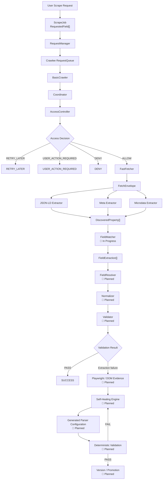
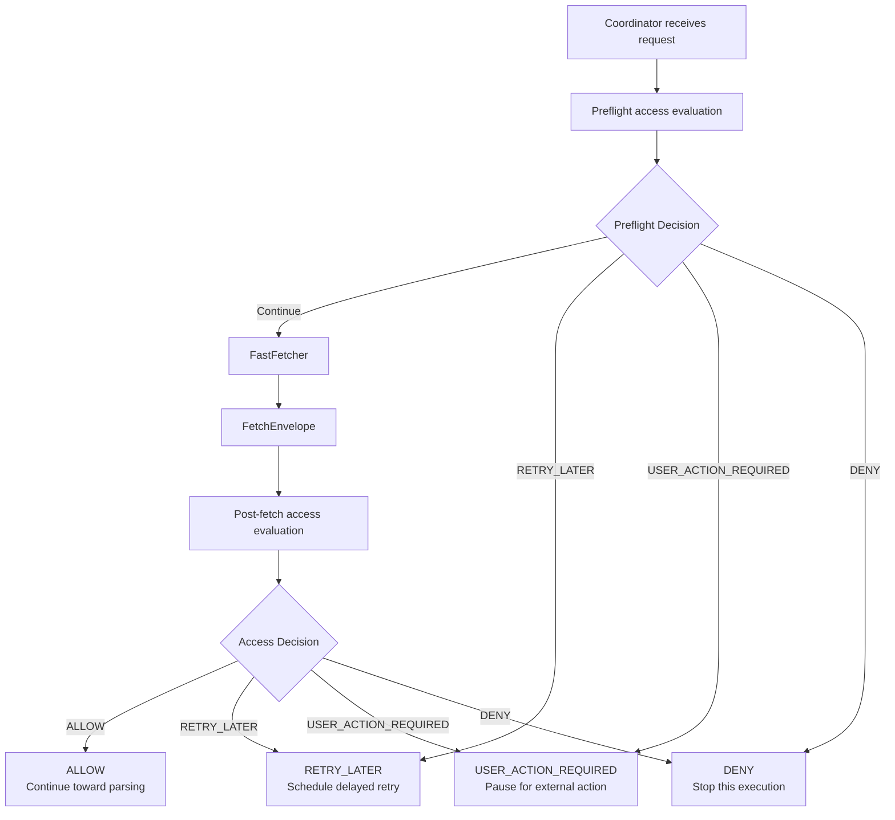
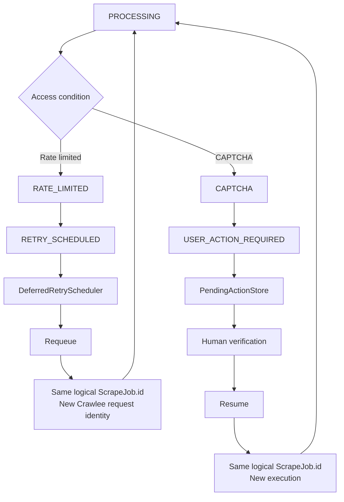
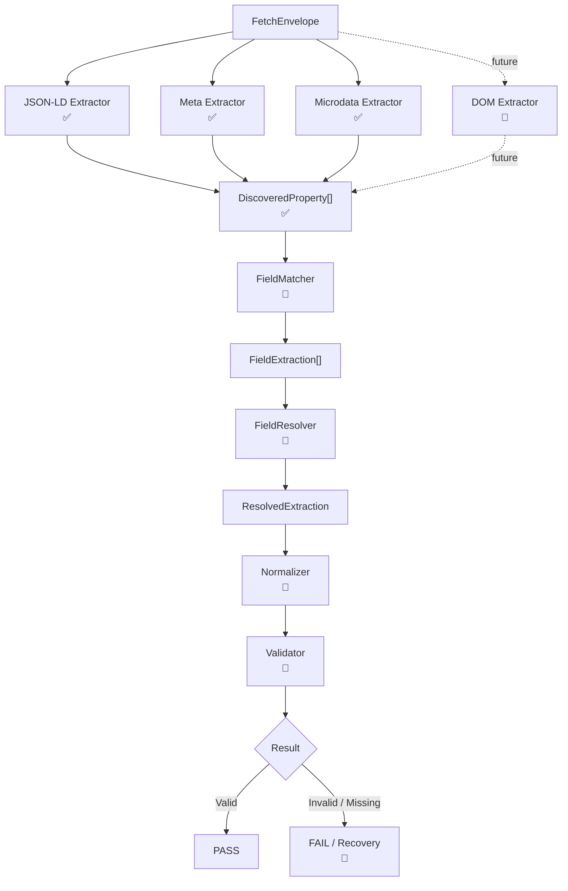

# Agentic Loop – Universal Adaptive Web Scraping Engine

Agentic Loop is a production-oriented foundation for building a **universal, adaptive, and eventually self-healing web scraping engine**.

The project is designed to scrape **different websites with different user-requested fields**, rather than being tied to one website, one schema, or one fixed set of business fields.

Examples include:

- job information from recruitment websites
- product information from e-commerce websites
- articles from news websites
- public information from social/public pages
- arbitrary fields dynamically requested by the user

The current implementation provides the crawling, access-control, fetching, retry, lifecycle, and universal structured-data discovery foundation.

The system is **not yet a complete self-healing scraper**.

Current development has reached:

> **Universal structured-data property discovery**

The next major stage is mapping those discovered properties to the fields requested by the user.

---

## Project Status Legend

| Symbol | Meaning |
|---|---|
| ✅ | Implemented and verified |
| 🚧 | In progress / next active development stage |
| 📌 | Planned |

---

## Why This Project Exists

Traditional scrapers are often built around assumptions such as:

```text
Find this selector
→ extract this field
→ return this value
```

That approach becomes fragile when:

- website HTML structures change
- websites expose data through different formats
- selectors stop matching
- access controls interrupt requests
- pages require browser rendering
- structured metadata differs between websites
- the requested fields vary between use cases

A job listing, product page, article, and public profile do not expose information in exactly the same way.

For example:

### Recruitment

A user may request:

```text
job title
company
salary
location
skills
experience
job URL
```

### E-commerce

A user may request:

```text
product name
price
rating
seller
availability
product URL
```

### News

A user may request:

```text
headline
author
publication date
article body
```

The architecture therefore cannot assume a predefined schema such as:

```text
businessName
address
phone
email
website
rating
```

Agentic Loop instead uses **dynamic requested fields** and a **field-agnostic extraction architecture**.

---

# Key Design Goals

## Universal fields

The scraper should support:

> **Any website + any explicitly requested fields**

Field definitions belong to each `ScrapeJob` rather than being hard-coded into the parser.

---

## Deterministic first

Known extraction mechanisms should always be attempted before AI-assisted recovery.

Current deterministic structured-data extraction includes:

- JSON-LD
- HTML metadata
- Microdata

Future stages will add:

- DOM extraction
- browser-rendered extraction
- deterministic field resolution
- validation

AI-assisted self-healing is intended to be the **last fallback**, not the primary extraction mechanism.

---

## Separate access failures from extraction failures

Access failures must never automatically trigger parser healing.

Examples of access problems include:

```text
429 Rate Limited
401 Unauthorized
403 Forbidden
CAPTCHA
Login requirement
Network failures
Timeouts
```

Examples of parser problems include:

```text
Requested field missing
Selector no longer matches
Page structure changed
Incorrect extraction evidence
```

These are fundamentally different failure classes.

The `AccessController` is responsible for access-related decisions.

Future parser validation and self-healing will be responsible for extraction failures.

---

## Modular extraction

Each deterministic extractor discovers properties independently.

Current extractors:

```text
JSON-LD
Meta
Microdata
```

Future extractors can be added without redesigning the requested-field contract.

---

## Preserve evidence

Extraction is designed to preserve information such as:

- property key
- full property path
- source
- vocabulary
- extractor identity
- original/raw value
- evidence snippet

Later matching and resolution stages can use this provenance to make safer decisions.

---

## Recoverability

Logical scrape jobs remain identifiable across retries and user-action pauses.

The same logical `ScrapeJob` can be requeued using a new Crawlee request identity.

---

## Testability

Major components are isolated behind explicit contracts and currently have focused unit tests.

---

## Eventual self-healing

The long-term architecture will be able to:

1. detect extraction failure
2. classify the failure
3. collect deterministic/browser evidence
4. generate parser configuration or selectors
5. test the generated configuration
6. validate the result
7. promote only verified configurations
8. version the promoted parser configuration

Self-healing is **planned and not implemented yet**.

---

# Current Development Status

| Component | Status | Description |
|---|---|---|
| RequestManager | ✅ | Creates logical scrape jobs and manages Crawlee RequestQueue interaction |
| Crawlee RequestQueue | ✅ | Queue-backed request execution |
| BasicCrawler | ✅ | Owns request consumption and crawler lifecycle |
| Coordinator | ✅ | Handles one crawler request and coordinates access/fetch lifecycle |
| AccessController | ✅ | Separates access failures from parser/extraction failures |
| FastFetcher | ✅ | Fetches a ScrapeJob and returns a bounded `FetchEnvelope` |
| FetchEnvelope | ✅ | Standardized HTTP response/error transport contract |
| DeferredRetryScheduler | ✅ | In-memory delayed retry scheduling |
| PendingActionStore | ✅ | Stores pending human-action requirements |
| Runtime job lifecycle | ✅ | Tracks processing/retry/access states |
| Dynamic `RequestedField[]` | ✅ | Universal user-requested field contract |
| `DiscoveredProperty[]` | ✅ | Universal extractor discovery contract |
| JSON-LD Extractor | ✅ | Universal recursive JSON-LD property discovery |
| Meta Extractor | ✅ | Universal title/meta property discovery |
| Microdata Extractor | ✅ | Universal itemscope/itemprop discovery |
| FieldMatcher | 🚧 | Next major stage: map requested fields to discovered properties |
| ParserOrchestrator | 🚧 | Planned coordination layer for deterministic parser execution |
| DomExtractor | 📌 | Future DOM-based discovery |
| FieldResolver | 📌 | Choose the best extraction candidate for a requested field |
| Normalizer | 📌 | Convert raw values into requested types/formats |
| Validator | 📌 | Validate resolved scrape results |
| Parser integration into Coordinator | 📌 | Coordinator currently stops at `READY_FOR_PARSING` |
| Playwright rendering fallback | 📌 | Dependencies installed, pipeline not integrated |
| Self-healing parser | 📌 | Future parser recovery system |
| AI parser configuration generation | 📌 | Future controlled AI-assisted fallback |
| Parser version manager | 📌 | Future configuration/version promotion |
| Healing validation/promotion | 📌 | Future deterministic verification before promotion |
| Monitoring dashboard | 📌 | Job-state/log foundation exists; dashboard does not |
| Persistent distributed retry scheduler | 📌 | Current scheduler is process-local and in-memory |

---

# System Architecture

The intended architecture separates crawling, access policy, fetching, discovery, matching, validation, and future self-healing.



### Current execution boundary

The current verified implementation reaches:

```text
FetchEnvelope
    ↓
JSON-LD / Meta / Microdata
    ↓
DiscoveredProperty[]
```

The next stage is `FieldMatcher`.

The current Coordinator access-success path reaches:

```text
READY_FOR_PARSING
```

It does **not** yet produce a final validated scrape result.

---

# Crawling and Coordination

A major architectural rule is:

> `BasicCrawler` owns request consumption.

The production flow is:

```text
Crawlee RequestQueue
        ↓
BasicCrawler
        ↓
requestHandler
        ↓
Coordinator.handle(request)
```

The Coordinator handles **one request**.

It should not own global crawler concurrency or manually pull jobs from the queue.

The crawler uses the RequestManager's Crawlee queue:

```ts
requestQueue: requestManager.getRequestQueue()
```

The crawler currently uses:

```ts
retryOnBlocked: false
```

because access/block policy belongs to `AccessController`, rather than being independently retried by Crawlee's blocked-response retry behavior.

For the current timer-based delayed retry design, the crawler also uses:

```ts
keepAlive: true
```

Application-level delayed retry does not depend on Crawlee request reclaim delay.

---

# Scrape Job Contract

The original scraper model used fixed fields.

That approach has been replaced by a universal dynamic schema.

## Requested field types

```ts
type RequestedFieldType =
  | "string"
  | "number"
  | "boolean"
  | "array";
```

## RequestedField

Conceptually:

```ts
interface RequestedField {
  name: string;
  type: RequestedFieldType;
  description?: string;
  aliases?: string[];
  paths?: string[];
  required?: boolean;
}
```

A scrape job must explicitly specify the fields it wants.

There are no implicit default business fields.

---

# Universal Schema Examples

## JobPosting request

```ts
const requestedFields = [
  {
    name: "jobTitle",
    type: "string",
    aliases: ["title", "position", "headline"],
    required: true
  },
  {
    name: "company",
    type: "string",
    aliases: ["company", "hiringOrganization"],
    required: true
  },
  {
    name: "salary",
    type: "number",
    aliases: ["salary", "baseSalary"],
    paths: ["$.baseSalary.value.value"]
  },
  {
    name: "location",
    type: "string",
    aliases: ["location", "jobLocation"]
  }
];
```

---

## Product request

```ts
const requestedFields = [
  {
    name: "productName",
    type: "string",
    aliases: ["name", "title"],
    required: true
  },
  {
    name: "price",
    type: "number",
    aliases: ["price", "salePrice", "currentPrice"],
    paths: ["$.offers.price"],
    required: true
  },
  {
    name: "rating",
    type: "number",
    aliases: ["ratingValue", "rating"]
  },
  {
    name: "availability",
    type: "string",
    aliases: ["availability", "stockStatus"]
  }
];
```

---

## Article request

```ts
const requestedFields = [
  {
    name: "headline",
    type: "string",
    aliases: ["headline", "title"],
    required: true
  },
  {
    name: "author",
    type: "string",
    aliases: ["author", "creator"]
  },
  {
    name: "publicationDate",
    type: "string",
    aliases: ["datePublished", "published", "publicationDate"]
  },
  {
    name: "articleBody",
    type: "string",
    aliases: ["articleBody", "body", "content"]
  }
];
```

These examples describe requested data only.

They do not hard-code the parser to a particular website or content type.

---

# RequestManager

`RequestManager` owns queue and logical job responsibilities.

Current responsibilities include:

- opening/managing the Crawlee `RequestQueue`
- creating `ScrapeJob` objects
- queue identity
- request deduplication
- runtime queue state
- retry/resume of logical jobs
- queue statistics

It does **not** own:

- HTTP parsing
- access policy
- HTML extraction
- field validation
- AI healing

---

## Logical job identity vs Crawlee request identity

These are intentionally different concepts.

```text
ScrapeJob.id
=
logical scraping operation
```

while:

```text
Crawlee Request ID
=
one queued execution attempt
```

For deferred retry or user-action resume:

```text
same ScrapeJob.id
        +
new Crawlee request identity
```

This keeps the logical operation identifiable while allowing new executions.

---

# Runtime Job Lifecycle

Current runtime state tracks information approximately equivalent to:

```ts
{
  status,
  attempt,
  deferredRetryCount,
  domain,
  lastAccessReason,
  lastError,
  updatedAt
}
```

Current lifecycle statuses include:

```text
QUEUED
PROCESSING
RETRYING
RETRY_SCHEDULED
USER_ACTION_REQUIRED
READY_FOR_PARSING
SUCCESS
FAILED_FINAL
```

`SUCCESS` exists in lifecycle contracts/helpers.

However:

> `ALLOW` from AccessController does not mean the scrape succeeded.

An `ALLOW` decision means:

> The content is accessible enough to continue processing.

The current production path then moves toward:

```text
READY_FOR_PARSING
```

Final success should only occur after the future:

```text
parser
→ resolver
→ normalizer
→ validator
```

pipeline succeeds.

---

# AccessController

`AccessController` separates access problems from extraction problems.

Supported decision categories are:

```text
ALLOW
RETRY_LATER
USER_ACTION_REQUIRED
DENY
```

Representative reasons include:

```text
RATE_LIMITED
AUTH_REQUIRED
FORBIDDEN
CAPTCHA
LOGIN_REQUIRED
ROBOTS_RESTRICTED
ACCOUNT_RESTRICTED
GEO_RESTRICTED
NETWORK_BLOCKED
CONNECTION_ERROR
SUBSCRIPTION_REQUIRED
SECURITY_CHALLENGE
SITE_UNAVAILABLE
TIMEOUT
DNS_ERROR
TLS_ERROR
OTHER
```

---

## AccessController Decision Flow



---

## Retryable conditions

Examples include:

```text
RATE_LIMITED
SITE_UNAVAILABLE
TIMEOUT
DNS_ERROR
CONNECTION_ERROR
```

Rate limiting should use resilient and policy-aware mechanisms such as:

- `Retry-After`
- cooldowns
- delayed retries
- backoff
- retry budgets

The project should not treat access controls as parser failures or describe its access strategy as bypassing protections.

---

## User-action conditions

Examples include:

```text
CAPTCHA
AUTH_REQUIRED
LOGIN_REQUIRED
SECURITY_CHALLENGE
NETWORK_BLOCKED
```

Some of these may require an external or human action before execution can continue.

---

## Denied conditions

Representative denied conditions include:

```text
FORBIDDEN
ROBOTS_RESTRICTED
ACCOUNT_RESTRICTED
GEO_RESTRICTED
SUBSCRIPTION_REQUIRED
TLS_ERROR
OTHER
```

---

# CAPTCHA and Human-in-the-Loop Model

CAPTCHA handling is intended to use a human-in-the-loop workflow.

The future workflow is:

```text
Browser / crawler session
        ↓
CAPTCHA detected
        ↓
USER_ACTION_REQUIRED
        ↓
preserve session reference
        ↓
user completes verification
        ↓
resume same logical ScrapeJob
```

A pending-action store already exists.

Sensitive browser/session information should not be copied into general job metadata.

The preferred architecture uses opaque references such as:

```text
sessionRef
```

instead of storing raw:

```text
cookies
passwords
tokens
```

inside general job state.

---

# Deferred Retry and User-Action Lifecycle



---

# Deferred Retry Scheduler

A deferred retry scheduler is already implemented.

Current implementation characteristics:

- in-memory
- timer-based
- one timer per logical job
- supports scheduling
- supports cancellation
- supports shutdown
- scheduling another retry for the same logical job can replace the previous timer

This is appropriate for the current MVP / long-running process architecture.

It is **not yet a distributed persistent scheduler**.

For horizontally distributed production execution, a persistent scheduling mechanism would eventually be preferable.

---

# FastFetcher

`FastFetcher` is implemented.

Its responsibility is approximately:

```text
ScrapeJob
    ↓
FastFetcher
    ↓
FetchEnvelope
```

`FetchEnvelope` standardizes information such as:

- requested URL
- final URL
- status code
- headers
- redirect chain
- timing
- response body
- body byte information
- content length
- body truncation
- transport errors
- body-read errors

Body reads are intentionally bounded.

Large responses may be intentionally truncated instead of allowing unrestricted memory growth.

Transport failures and body-read failures are represented separately.

---

# Shared HTTP Client

`BasicCrawler` and `FastFetcher` use the same injected HTTP client abstraction.

This keeps HTTP behavior consistent across crawling and explicit fetch operations.

The current stack uses Crawlee's HTTP client infrastructure / `GotScrapingHttpClient` through the shared client abstraction.

---

# Universal Parser Architecture

The parser architecture was migrated away from predefined domain fields.

The current extractor contract revolves around:

```ts
DiscoveredProperty[]
```

A discovered property conceptually looks like:

```ts
interface DiscoveredProperty {
  key: string;
  path: string;
  value: string | number | boolean | string[] | null;
  source: ExtractionSource;
  vocabulary?: ExtractionVocabulary;
  extractorId: string;
  snippet?: string;
}
```

The responsibility of an extractor is:

> **Discover what properties exist in the content.**

The extractor should not decide:

```text
Is this jobTitle?
Is this productName?
Is this businessName?
```

That responsibility belongs to the future `FieldMatcher`.

---

# Universal Parser Flow



---

# Deterministic Extractor Contract

The previous candidates-based extractor contract has been removed.

The current universal extractor result is:

```ts
interface ExtractorOutput {
  discovered: DiscoveredProperty[];
  warnings: ExtractionWarning[];
}
```

Current extractors follow an interface conceptually equivalent to:

```ts
interface DeterministicExtractor {
  readonly id: string;

  supports(input: ParserInput): boolean;

  extract(input: ParserInput): Promise<ExtractorOutput>;
}
```

The JSON-LD, Meta, and Microdata extractors all use this universal contract.

---

# JSON-LD Extractor

**Status: ✅ Implemented**

The JSON-LD extractor:

- finds all `<script type="application/ld+json">` elements
- parses JSON-LD content
- processes every JSON-LD entity
- does not filter by `@type`
- recursively flattens nested objects
- supports top-level arrays
- supports nested arrays and objects
- preserves arrays of strings
- detects Schema.org context
- records full property paths
- continues after malformed JSON-LD blocks
- produces warnings for malformed blocks
- limits evidence snippets
- rejects explicitly non-HTML responses

Examples of generated paths include:

```text
$.name
$.offers.price
$.hiringOrganization.name
$[0].name
$["@type"]
```

It can therefore discover data from entities such as:

```text
Product
JobPosting
Article
Organization
Person
Event
custom schemas
```

without hard-coding those entity types.

Current JSON-LD tests:

```text
8 passing
```

---

# Meta Extractor

**Status: ✅ Implemented**

The Meta extractor discovers:

```html
<title>
```

and arbitrary metadata such as:

```html
<meta property="...">
<meta name="...">
```

Examples include:

```text
title
og:title
og:url
og:description
og:image
twitter:title
twitter:description
description
author
robots
article:author
```

Recognized metadata vocabulary categories include:

```text
OPEN_GRAPH
TWITTER_CARD
HTML_META
```

The extractor does not perform domain-specific mappings such as:

```text
og:title → businessName
og:url   → website
```

Instead, it reports the raw discovered properties.

Important behavior includes:

- ignores empty optional metadata
- preserves multiple values for the same key
- tolerates malformed HTML through Cheerio
- normalizes metadata keys case-insensitively
- limits evidence snippets
- rejects explicitly non-HTML responses

Current Meta tests:

```text
11 passing
```

---

# Microdata Extractor

**Status: ✅ Implemented**

The Microdata extractor processes generic:

```text
itemscope
itemtype
itemprop
```

It does not restrict extraction to specific schemas such as `Organization` or `LocalBusiness`.

It can discover properties from:

```text
Product
JobPosting
Article
Organization
LocalBusiness
PostalAddress
AggregateRating
custom item types
```

and other Microdata scopes.

A major structural rule is:

> A property belongs to its nearest `itemscope`.

This prevents properties from nested scopes from incorrectly leaking into parent entities.

The extractor also supports multiple property names in one attribute.

For example:

```html
itemprop="name headline"
```

can produce both:

```text
name
headline
```

Raw values remain unnormalized.

For example:

```html
<meta itemprop="price" content="24999">
```

currently discovers:

```text
"24999"
```

as a string.

Conversion to:

```ts
24999
```

as a number belongs to the future `Normalizer`.

Current Microdata tests:

```text
12 passing
```

---

# Extraction Examples

## JSON-LD

Source:

```json
{
  "@context": "https://schema.org",
  "@type": "Product",
  "name": "Example Laptop",
  "offers": {
    "price": 24999
  }
}
```

Possible discovered property:

```ts
{
  key: "price",
  path: "$.offers.price",
  value: 24999,
  source: "JSON_LD",
  vocabulary: "SCHEMA_ORG",
  extractorId: "json-ld"
}
```

---

## Meta

Source:

```html
<meta property="og:title" content="Example Article">
```

Possible discovered property:

```ts
{
  key: "og:title",
  path: "og:title",
  value: "Example Article",
  source: "META",
  vocabulary: "OPEN_GRAPH",
  extractorId: "meta"
}
```

---

## Microdata

Source:

```html
<div itemscope itemtype="https://schema.org/Product">
  <meta itemprop="price" content="24999">
</div>
```

Possible discovered property:

```ts
{
  key: "price",
  path: "price",
  value: "24999",
  source: "MICRODATA",
  extractorId: "microdata"
}
```

The value intentionally remains a string until the future normalization stage.

---

# FieldMatcher

**Status: 🚧 Next major development step**

`FieldMatcher` will connect the two universal contracts:

```text
RequestedField[]
        +
DiscoveredProperty[]
        ↓
FieldMatcher
        ↓
FieldExtraction[]
```

The intended deterministic matching strategy is:

1. explicit requested `paths`
2. exact property-key match to requested field name
3. exact alias match
4. normalized case-insensitive match
5. conservative synonym mapping
6. optional low-confidence fallback later

No AI-based field matching is implemented currently.

---

## FieldMatcher Example

Requested field:

```ts
{
  name: "price",
  type: "number",
  aliases: ["salePrice", "currentPrice"],
  paths: ["$.offers.price"]
}
```

Discovered property:

```ts
{
  key: "price",
  path: "$.offers.price",
  value: 24999,
  source: "JSON_LD"
}
```

The future matcher may produce a candidate conceptually equivalent to:

```ts
{
  field: "price",
  value: 24999,
  confidence: 1,
  evidence: {
    source: "JSON_LD",
    path: "$.offers.price"
  }
}
```

The final `FieldExtraction` contract should be treated as part of the upcoming implementation rather than a completed parser stage.

---

# Field Resolution

The future pipeline is intended to continue:

```text
DiscoveredProperty[]
        ↓
FieldMatcher
        ↓
FieldExtraction[]
        ↓
FieldResolver
        ↓
ResolvedExtraction
        ↓
Normalizer
        ↓
Validator
```

`FieldResolver` will eventually select the strongest candidate when several extractors discover possible values for the same field.

For example:

```text
JSON-LD price
Microdata price
Meta price
DOM price
```

Resolution can later consider evidence strength, source reliability, and matcher confidence.

---

# Playwright

Playwright dependencies are already installed.

However:

> **Playwright browser rendering is not yet integrated into the extraction pipeline.**

The intended future flow is:

```text
Static HTTP response
        ↓
Structured extractors
        ↓
Requested data still missing
        ↓
Playwright rendering
        ↓
DOM / network / screenshot evidence
        ↓
retry deterministic extraction
        ↓
self-healing only if necessary
```

Playwright fallback should therefore not currently be treated as an implemented feature.

---

# Self-Healing Architecture

**Status: 📌 Planned**

Self-healing is not implemented yet.

The intended future model is:

```text
Deterministic extraction
        ↓
Validation
        ↓
      PASS
       or
      FAIL
        ↓
Failure classification
        ↓
Parser/extraction failure?
        ↓
Self-Healing Engine
        ↓
Analyze deterministic/browser evidence
        ↓
Generate parser configuration/selectors
        ↓
Run deterministic test
        ↓
Validate
        ↓
Promote working configuration
        ↓
Version management
```

The goal is **not** unrestricted AI source-code rewriting.

The safer intended design is for AI to generate constrained parser configuration/selectors that can be tested deterministically before promotion.

---

## Deterministic First, AI Last

The intended priority is:

```text
Known structured data
        ↓
Known deterministic extraction
        ↓
DOM extraction
        ↓
Browser rendering
        ↓
Validation
        ↓
Only then:
AI-assisted parser recovery
```

AI-generated configurations must not be promoted simply because they produced some output.

They should first pass deterministic validation.

---

# Monitoring and Observability

A monitoring foundation currently exists through:

- runtime job status
- attempt counts
- deferred retry count
- domain
- access reason
- last error
- timestamps
- queue statistics
- logs

`RequestManager.getStats()` currently exposes values such as:

```text
total
handled
pending
```

A full observability dashboard is **not implemented**.

---

## Future Monitoring Architecture

```text
Crawler
   ↓
Coordinator
   ↓
Lifecycle Events
   ↓
Metrics / Monitoring Store
   ↓
Dashboard / Alerts
```

Future monitoring should include areas such as:

### Access health

```text
429 rate
CAPTCHA rate
login-wall rate
timeout rate
connection-error rate
```

### Extraction health

```text
requested-field success
missing-field rate
parser failure
candidate counts
invalid fields
```

### Healing health

```text
healing attempts
healing success rate
parser versions
repeated site breakages
```

### System health

```text
active jobs
overall scrape success rate
failure rate
retry rate
average scrape duration
domain health
```

The dashboard, event store, and persistence layers remain planned work.

---

# Technology Stack

| Area | Technology |
|---|---|
| Language | TypeScript |
| Runtime | Node.js >= 22.19.0 |
| Crawler | Crawlee `BasicCrawler` |
| Crawlee packages | `@crawlee/core`, `@crawlee/basic` |
| Browser dependencies | `@crawlee/playwright`, Playwright |
| HTML parsing | Cheerio |
| HTTP | Crawlee shared HTTP client / GotScraping-based client abstraction |
| Testing | Vitest |
| Coverage | `@vitest/coverage-v8` |
| Build | TypeScript compiler |
| Development runner | `tsx` |

Current dependency baseline is approximately:

```json
{
  "dependencies": {
    "@crawlee/basic": "^3.18.0",
    "@crawlee/core": "^3.18.0",
    "@crawlee/playwright": "^3.18.0",
    "cheerio": "^1.2.0",
    "playwright": "^1.62.1"
  },
  "devDependencies": {
    "@types/node": "^22.0.0",
    "@vitest/coverage-v8": "^4.1.10",
    "tsx": "^4.23.12",
    "typescript": "^7.0.2",
    "vite": "^8.2.1",
    "vitest": "^4.1.10"
  }
}
```

---

# Project Structure

The repository is currently organized around the following major areas:

```text
agentic-loop/
├── src/
│   ├── access-controller/
│   │   └── detectors/
│   │
│   ├── config/
│   │
│   ├── coordinator/
│   │   ├── schedulers/
│   │   └── stores/
│   │
│   ├── core/
│   │   └── contracts/
│   │       └── parser/
│   │
│   ├── fetcher/
│   │
│   ├── parser/
│   │   └── extractors/
│   │
│   ├── request-manager/
│   │
│   └── main.ts
│
├── package.json
├── tsconfig.json
└── .gitignore
```

The exact tree will continue evolving as FieldMatcher and later parser stages are implemented.

---

# Installation

## Prerequisites

Use:

```text
Node.js >= 22.19.0
```

Install project dependencies:

```bash
npm install
```

---

# Playwright Browser Installation

Playwright dependencies are already part of the project.

Install the required browser binaries with:

```bash
npm run browser:install
```

This prepares the environment for browser-based work.

The Playwright fallback itself is still planned and is not yet wired into the parser pipeline.

---

# Development

Run the project in development mode:

```bash
npm run dev
```

The active execution flow currently focuses on the crawler/access/fetch foundation and the structured-property parser components.

---

# Verification

Run TypeScript type checking:

```bash
npm run typecheck
```

Run tests:

```bash
npm test
```

Run the production build:

```bash
npm run build
```

Current verified baseline:

```text
10 test files
76 tests
76 passing
TypeScript typecheck: PASS
Build: PASS
```

---

# Test Coverage Overview

| Test File | Tests |
|---|---:|
| `fast-fetcher.test.ts` | 10 |
| `coordinator.test.ts` | 6 |
| `in-memory-deferred-retry.scheduler.test.ts` | 6 |
| `in-memory-pending-action.store.test.ts` | 6 |
| `access-controller.test.ts` | 4 |
| `redirect.detector.test.ts` | 6 |
| `challenge.detector.test.ts` | 7 |
| `json-ld.extractor.test.ts` | 8 |
| `meta.extractor.test.ts` | 11 |
| `microdata.extractor.test.ts` | 12 |
| **Total** | **76** |

Current verification:

```text
npm run typecheck
PASS

npm test
76/76 PASS

npm run build
PASS
```

---

# Current Limitations

The project is deliberately being developed in stages.

The current repository should **not** be interpreted as a completed universal scraping product.

Current limitations include:

- extraction currently focuses on structured HTML data
- FieldMatcher is not implemented yet
- discovered properties are not yet mapped into complete requested-field results
- ParserOrchestrator is not complete
- DOM fallback is not implemented
- Playwright fallback is not integrated
- FieldResolver is not implemented
- Normalizer is not implemented
- Validator is not implemented
- parser execution is not yet integrated into Coordinator's final result path
- Coordinator currently reaches `READY_FOR_PARSING`
- self-healing is not implemented
- AI-generated parser configuration is not implemented
- parser version promotion is not implemented
- the retry scheduler is currently in-memory
- no persistent distributed scheduler exists yet
- no full monitoring dashboard exists yet

These limitations are intentional development boundaries rather than claims of completed functionality.

---

# Roadmap

## Phase 1 — Core Crawling and Access Foundation ✅

Implemented:

- dynamic `ScrapeJob`
- RequestManager
- Crawlee RequestQueue integration
- BasicCrawler
- Coordinator
- shared HTTP client
- FastFetcher
- FetchEnvelope
- AccessController
- access detectors/policy
- deferred retry scheduler
- pending user-action store
- job runtime lifecycle

---

## Phase 2 — Universal Structured-Data Discovery ✅

Implemented:

- dynamic `RequestedField[]`
- universal `DiscoveredProperty[]`
- universal extractor contract
- JSON-LD discovery
- HTML metadata discovery
- Microdata discovery
- removal of business-specific parser assumptions

---

## Phase 3 — FieldMatcher 🚧

Next active stage:

```text
RequestedField[]
        +
DiscoveredProperty[]
        ↓
FieldMatcher
        ↓
FieldExtraction[]
```

Primary goal:

> Deterministically map discovered properties to fields explicitly requested by the user.

---

## Phase 4 — ParserOrchestrator 🚧

Coordinate deterministic extractors and matching stages through one parser pipeline.

---

## Phase 5 — DOM Extraction 📌

Add generic DOM-based property/candidate discovery when structured metadata is insufficient.

---

## Phase 6 — Resolution, Normalization and Validation 📌

Implement:

```text
FieldResolver
    ↓
Normalizer
    ↓
Validator
```

This stage will enable the system to determine whether a scrape actually produced a valid result.

---

## Phase 7 — Playwright Fallback 📌

Use browser rendering only when static extraction is insufficient.

Potential evidence sources:

- rendered DOM
- browser network data
- dynamic page state
- screenshots when useful for later failure analysis

---

## Phase 8 — Self-Healing 📌

Implement controlled recovery for parser/extraction failures.

Target flow:

```text
Failure
→ evidence
→ generated parser configuration
→ deterministic test
→ validation
→ versioned promotion
```

---

## Phase 9 — Monitoring, Persistence and Distributed Execution 📌

Future production infrastructure may include:

- lifecycle event store
- metrics
- dashboard
- alerts
- persistent retries
- distributed scheduler
- distributed execution state
- domain health monitoring
- parser health monitoring
- healing metrics

---

# Engineering Principles

## 1. Deterministic first

Use explicit deterministic extraction whenever possible.

AI is the fallback, not the default parser.

---

## 2. AI last

AI should only be introduced after deterministic extraction and validation have established that recovery is necessary.

---

## 3. Never confuse access failure with parser failure

```text
429
CAPTCHA
403
login requirement
network failure
```

must not trigger selector regeneration.

Only actual extraction/parser failures should enter the future self-healing pipeline.

---

## 4. Preserve evidence

Do not discard provenance after extracting a value.

Later resolver and healing stages should know:

```text
where the value came from
which extractor found it
which path produced it
what the raw value was
```

---

## 5. Keep logical jobs identifiable across retries

Retries should preserve the logical:

```text
ScrapeJob.id
```

while using a new execution/request identity where required.

---

## 6. ALLOW is not SUCCESS

`ALLOW` means the system can continue processing.

Final success requires extraction and validation.

---

## 7. Keep crawling and parsing separate

Crawler lifecycle should not become tightly coupled to parser implementation.

`BasicCrawler` owns request consumption.

`Coordinator` handles one request.

Parser layers operate on fetched content/evidence.

---

## 8. Validate before promoting self-healed configurations

A generated selector/configuration should never become trusted merely because it returned a value once.

Future promotion should require deterministic validation.

---

# Monitoring Philosophy

The project distinguishes operational health into separate categories.

## Access health

Can the system retrieve the content?

## Extraction health

Can deterministic parsers discover the required evidence?

## Result health

Can that evidence produce valid requested fields?

## Healing health

When deterministic extraction fails, can the recovery system produce and validate a safe replacement configuration?

Keeping these dimensions separate makes failure diagnosis substantially clearer.

---

# Contributing / Development Notes

The project is actively evolving.

When adding new functionality:

1. keep modules isolated behind explicit contracts
2. avoid introducing website-specific assumptions into universal layers
3. add tests for behavioral changes
4. preserve access/parser separation
5. do not mark a scrape successful before validation
6. keep extractor output field-agnostic
7. prefer deterministic behavior over heuristic or AI behavior
8. run the complete verification suite before committing

Before submitting changes:

```bash
npm run typecheck
npm test
npm run build
```

All three should remain green.

---

# License

No license has been specified yet.

Add the repository's actual license here when one is selected.
