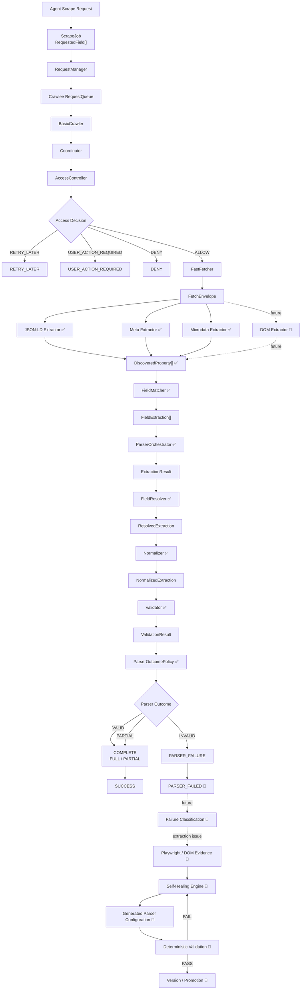
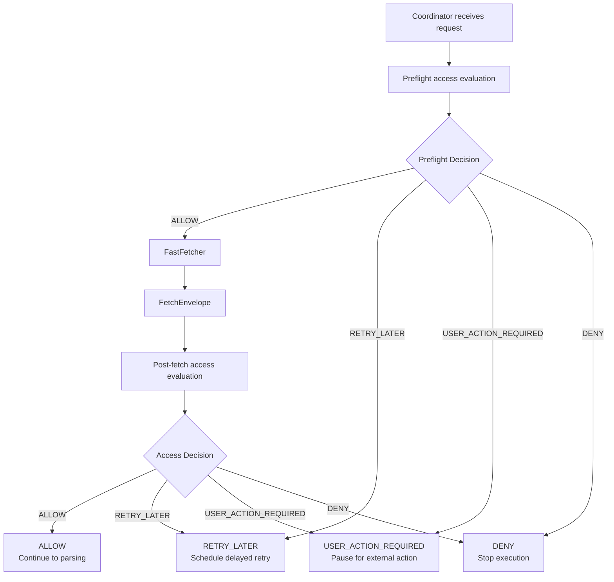
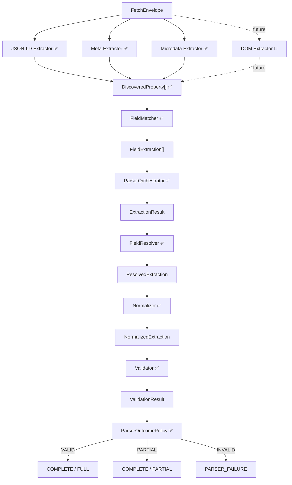
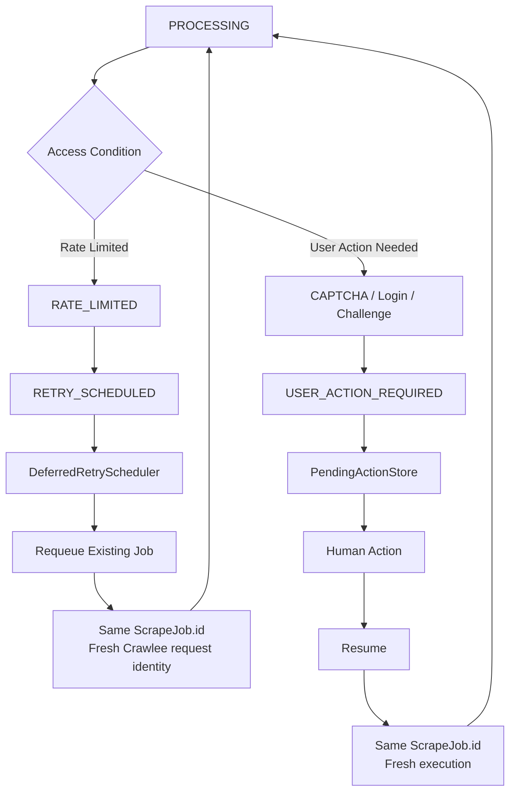
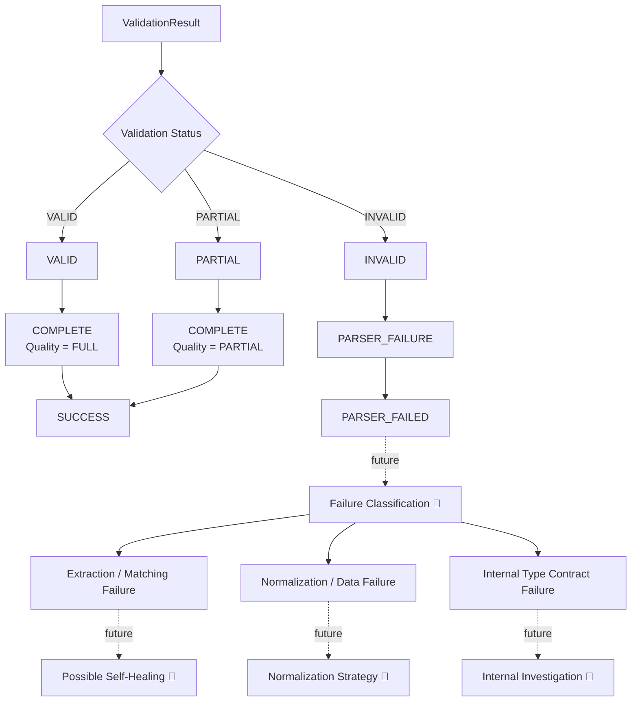
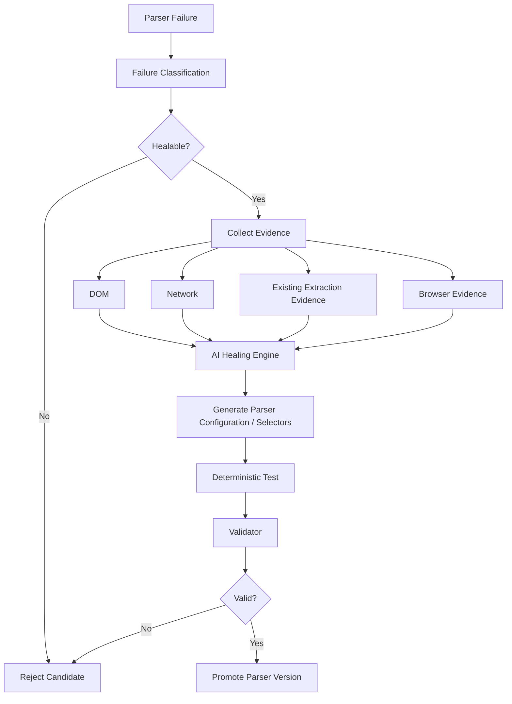

# Agentic Loop – Universal Adaptive Web Scraping Engine

Agentic Loop is a **universal, adaptive web scraping engine** designed to scrape different websites and dynamically extract whatever fields the user requests.

The long-term goal is to build a scraper that can detect extraction failures, classify them correctly, adapt to website changes, validate generated fixes, and eventually **self-heal automatically**.

> The deterministic scraping pipeline is being built first. AI/self-healing will be added only after the extraction, validation, and failure-classification layers are reliable.

---

## What I Am Building

```text
Agent Request
    ↓
ScrapeJob + RequestedField[]
    ↓
RequestManager
    ↓
Crawlee RequestQueue
    ↓
BasicCrawler
    ↓
Coordinator
    ↓
AccessController
    ↓
FastFetcher
    ↓
FetchEnvelope
    ↓
Structured Data Extraction
    ↓
Field Matching
    ↓
Field Resolution
    ↓
Normalization
    ↓
Validation
    ↓
Parser Outcome Policy
    ↓
SUCCESS / PARSER_FAILED
    ↓
Future Failure Classification
    ↓
Future Self-Healing
```

The system is designed to support:

- Job websites
- E-commerce websites
- News websites
- Product/catalog websites
- Public/social pages
- Structured-data-heavy websites
- Other websites with arbitrary requested fields

It is **not limited to one website type or fixed business fields**.

---

# Current Progress

## ✅ Crawling & Request Foundation

Implemented:

- RequestManager
- Crawlee RequestQueue
- BasicCrawler
- Coordinator
- Logical ScrapeJob lifecycle
- Retry lifecycle
- Deferred retry scheduler
- Pending user-action store
- Runtime job state
- Shared HTTP client architecture

---

## ✅ Access Layer

AccessController supports:

```text
ALLOW
RETRY_LATER
USER_ACTION_REQUIRED
DENY
```

Current access handling includes:

- Rate limits / 429
- Authentication requirements
- Forbidden responses
- CAPTCHA/security challenges
- Login requirements
- Redirect analysis
- Network/transport failures
- Retry scheduling
- Human-action pausing and resuming

Access failure is intentionally kept separate from parser failure.

---

## ✅ Fetch Layer

FastFetcher produces a structured:

```text
FetchEnvelope
```

It preserves information such as:

- URL
- HTTP method
- Status code
- Headers
- Final URL
- Redirect chain
- Timing
- Response body
- Body truncation
- Content length
- Transport errors
- Body-read errors

---

# Universal Requested Schema

Each scraping job defines its requested fields dynamically through:

```text
RequestedField[]
```

Example:

```ts
{
    name: 'price',
    type: 'number',
    aliases: ['salePrice', 'currentPrice'],
    paths: ['offers.price'],
    required: true
}
```

Supported types:

```text
string
number
boolean
array
```

There are no fixed business-specific output fields.

---

# Universal Structured Data Discovery

Current deterministic extractors output:

```text
DiscoveredProperty[]
```

Extraction is intentionally separated from requested-field matching.

---

## ✅ JSON-LD Extractor

Supports arbitrary JSON-LD structures including:

- Product
- JobPosting
- Article
- Organization
- Person
- Event
- Nested objects
- Arrays
- `@graph`
- Custom Schema.org structures

Example discovered paths:

```text
$.offers.price
$.hiringOrganization.name
$.address.addressLocality
```

---

## ✅ Meta Extractor

Discovers metadata such as:

```text
title
description
author
robots
og:title
og:url
og:image
og:description
twitter:title
twitter:description
article:author
```

Metadata stays field-agnostic until FieldMatcher runs.

---

## ✅ Microdata Extractor

Supports:

```text
itemscope
itemtype
itemprop
```

Including nested Microdata structures such as:

- Product
- JobPosting
- Article
- Organization
- PostalAddress
- AggregateRating
- Custom item types

---

# ✅ FieldMatcher

FieldMatcher connects:

```text
RequestedField[]
        +
DiscoveredProperty[]
        ↓
DefaultFieldMatcher
        ↓
FieldExtraction[]
```

Matching priority:

```text
1. Explicit path
2. Exact field name
3. Explicit alias
4. Normalized identifier
5. Conservative synonym mapping
```

Example:

```text
Requested:
price

Discovered:
$.offers.price = 24999

Result:
price → 24999
```

Multiple candidates are preserved for FieldResolver.

---

# ✅ ParserOrchestrator

ParserOrchestrator:

- Runs supported deterministic extractors
- Aggregates discovered properties
- Aggregates extractor warnings
- Calls FieldMatcher
- Groups candidates by requested field
- Calculates missing fields

Output:

```text
ExtractionResult
```

Parser statuses:

```text
PARSED
PARTIAL
NO_DATA
```

Flow:

```text
FetchEnvelope
    ↓
JSON-LD / Meta / Microdata
    ↓
DiscoveredProperty[]
    ↓
FieldMatcher
    ↓
FieldExtraction[]
    ↓
ExtractionResult
```

---

# ✅ FieldResolver

Different extraction sources may return multiple candidates.

Example:

```text
price
├── JSON-LD      24999
├── Microdata   "24999"
└── Meta         25999
```

Resolution rules:

```text
1. Highest confidence wins
2. If confidence ties → source priority
3. If still tied → first candidate wins
```

Source tie-breaking priority:

```text
JSON_LD
    ↓
MICRODATA
    ↓
META
    ↓
DOM
```

Output:

```text
ResolvedExtraction
```

---

# ✅ Normalizer

Normalizer converts resolved values according to the requested type.

Example:

```text
Requested:
price: number

Resolved:
"24999"

Normalized:
24999
```

Normalizer v1 intentionally uses conservative rules.

### String

```text
"Acme" → "Acme"
24999   → "24999"
true    → "true"
```

### Number

Accepted:

```text
"24999" → 24999
"-42.5" → -42.5
".75"   → 0.75
"1e3"   → 1000
```

Rejected:

```text
₹24,999
$19.99
1,234
24k
12 lakh
NaN
Infinity
```

### Boolean

Accepted:

```text
true
false
"true"
"false"
```

### Array

Currently supports:

```text
string[]
```

No automatic comma splitting or scalar wrapping is performed.

---

# ✅ Validator

Validator determines whether the requested schema was successfully satisfied.

Statuses:

```text
VALID
PARTIAL
INVALID
```

### VALID

Every requested field is valid.

### PARTIAL

Every required field is valid, but one or more optional fields are missing or invalid.

### INVALID

A required field is missing/invalid, or no requested field is valid.

Validation issues distinguish:

```text
MISSING_REQUIRED_FIELD
NORMALIZATION_FAILED
TYPE_MISMATCH
```

---

# ✅ DefaultParserPipeline

The deterministic parser components are now connected through one pipeline:

```text
ParserInput
    ↓
ParserOrchestrator
    ↓
ExtractionResult
    ↓
FieldResolver
    ↓
ResolvedExtraction
    ↓
Normalizer
    ↓
NormalizedExtraction
    ↓
Validator
    ↓
ValidationResult
```

The pipeline returns:

```text
ParserPipelineResult
```

which preserves every stage for future:

- Monitoring
- Diagnostics
- Failure classification
- Self-healing analysis
- Parser version comparison

---

# ✅ ParserOutcomePolicy

Validation quality is kept separate from lifecycle state.

Current policy:

| Validation | Outcome | Quality |
|---|---|---|
| `VALID` | `COMPLETE` | `FULL` |
| `PARTIAL` | `COMPLETE` | `PARTIAL` |
| `INVALID` | `PARSER_FAILURE` | — |

Therefore:

```text
VALID
    ↓
COMPLETE / FULL

PARTIAL
    ↓
COMPLETE / PARTIAL

INVALID
    ↓
PARSER_FAILURE
```

`PARTIAL` is not automatically treated as job failure if all required fields succeeded.

`INVALID` also does **not** automatically trigger AI/self-healing.

---

# 🚧 Currently Working On

## Parser Lifecycle Integration

The next lifecycle state is:

```text
PARSER_FAILED
```

It represents:

> The page was accessed successfully, but the deterministic parser pipeline could not satisfactorily validate the requested schema.

Expected transition:

```text
PROCESSING
    ↓
Fetch allowed
    ↓
ParserPipeline
    ↓
ParserOutcomePolicy
    ↓
PARSER_FAILURE
    ↓
PARSER_FAILED
```

`PARSER_FAILED` must not automatically:

```text
retry
trigger AI
trigger self-healing
modify access retry counters
become FAILED_FINAL
```

The next step after this lifecycle checkpoint is integrating the ParserPipeline into Coordinator.

---

# 📌 Still To Build

Major remaining components:

- Complete parser lifecycle integration
- ParserPipeline integration with Coordinator
- Parser failure classification
- DOM Extractor
- Playwright dynamic rendering fallback
- Self-healing engine
- AI-generated parser configurations/selectors
- Healing validation
- Parser configuration version management
- Promotion / rollback
- Monitoring dashboard
- Persistent/distributed retry scheduler
- Production persistence

---

# Development Progress

```text
✅ Phase 1  — Crawling & Access Foundation
✅ Phase 2  — Universal Structured Data Discovery
✅ Phase 3  — FieldMatcher
✅ Phase 4  — ParserOrchestrator
✅ Phase 5  — FieldResolver
✅ Phase 6  — Normalizer
✅ Phase 7  — Validator
✅ Phase 8  — Parser Pipeline
✅ Phase 9  — Parser Outcome Policy

🚧 Phase 10 — Parser Lifecycle / Coordinator Integration

📌 Phase 11 — DOM Extraction
📌 Phase 12 — Playwright Fallback
📌 Phase 13 — Failure Classification
📌 Phase 14 — Self-Healing
📌 Phase 15 — Monitoring & Production Persistence
```

---

# Current Verified Baseline

```text
Test Files: 17 passed
Tests:      131 passed
Failures:   0

TypeScript Typecheck: PASS
Build: PASS
```

> Parser lifecycle changes currently being added are not included in this verified 131-test baseline yet.

---

# Tech Stack

- Node.js
- TypeScript
- Crawlee
- Crawlee BasicCrawler
- Crawlee RequestQueue
- GotScraping HTTP client
- Playwright
- Cheerio
- Vitest

Playwright is installed but browser fallback is **not yet connected to the parser pipeline**.

---

# Full System Architecture



---

# AccessController Decision Flow



---

# Universal Parser Flow



---

# Retry + Human Action Lifecycle



---

# Parser Failure Lifecycle



---

# Important Engineering Principle

Agentic Loop intentionally separates:

```text
ACCESS FAILURE
        ≠
PARSER FAILURE
        ≠
NORMALIZATION FAILURE
        ≠
VALIDATION FAILURE
```

Examples of access problems:

```text
429
CAPTCHA
403
network timeout
```

Examples of parser/extraction problems:

```text
required field missing
incorrect extraction candidate
website structure changed
```

Example normalization/data problem:

```text
"Salary not disclosed" → requested number
```

These failures should not all trigger the same retry or healing strategy.

---

# Self-Healing Vision

Self-healing is **not implemented yet**.

The future architecture is:



Core principle:

> **Deterministic first. AI last. Validate before promotion.**

AI should generate parser configurations/selectors rather than blindly rewriting production source code.

---

# Monitoring Foundation

Current runtime monitoring information includes:

```text
status
attempt
deferredRetryCount
domain
lastAccessReason
lastError
updatedAt
```

Future monitoring will include:

- Active jobs
- Success rate
- Parser failure rate
- Retry rate
- 429 rate
- CAPTCHA rate
- Average scrape duration
- Missing-field rate
- Normalization failure rate
- Validation failure rate
- Healing attempts
- Healing success rate
- Domain health
- Parser version health

A dedicated monitoring dashboard is still planned.

---

# Run Project

Install dependencies:

```bash
npm install
```

Install Playwright Chromium:

```bash
npm run browser:install
```

Run development mode:

```bash
npm run dev
```

Run verification:

```bash
npm run typecheck
npm test
npm run build
```

---

# Current Status

```text
Core crawling infrastructure       ✅ Complete
Access-control foundation          ✅ Complete
Fast fetching                      ✅ Complete
Universal structured discovery     ✅ Complete
FieldMatcher                       ✅ Complete
ParserOrchestrator                 ✅ Complete
FieldResolver                      ✅ Complete
Normalizer                         ✅ Complete
Validator                          ✅ Complete
DefaultParserPipeline              ✅ Complete
ParserOutcomePolicy                ✅ Complete

Parser lifecycle integration       🚧 In Progress
Coordinator parser integration     📌 Next
DOM extraction                     📌 Planned
Playwright fallback                📌 Planned
Failure classification             📌 Planned
Self-healing                       📌 Planned
Monitoring dashboard               📌 Planned
```

---

## Current Verified Baseline

```text
17 test files
131 tests
131 / 131 passing

TypeScript Typecheck: PASS
Build: PASS
```

The project now has a complete **deterministic universal parsing pipeline**.

The immediate next work is connecting parser outcomes safely into the RequestManager lifecycle and Coordinator before moving to DOM/browser fallback and self-healing.