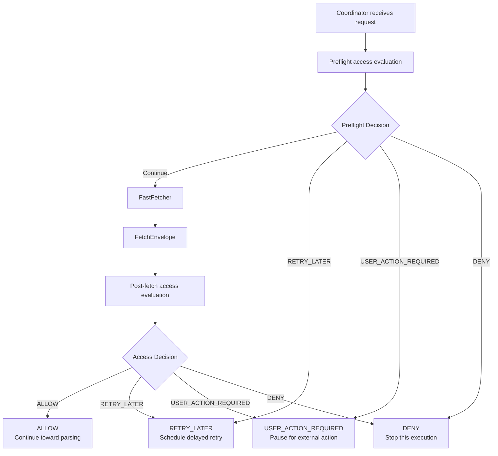
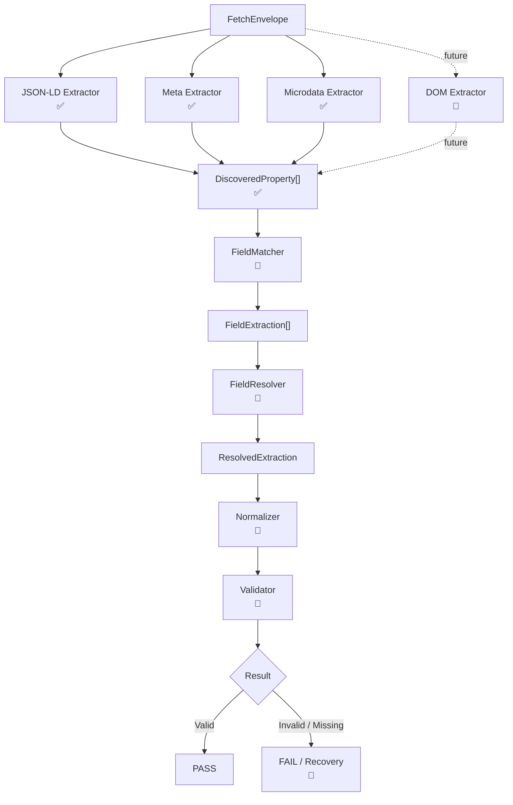
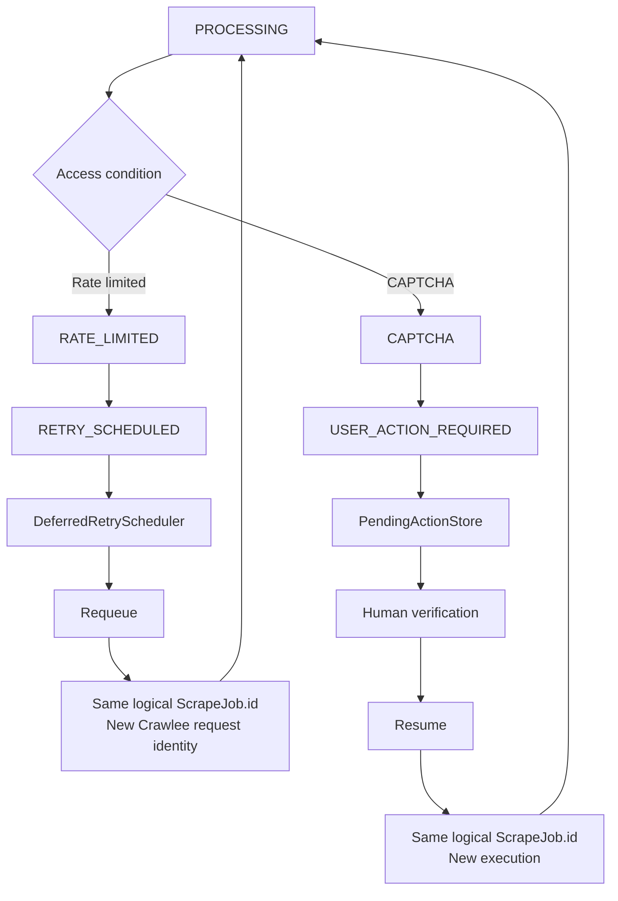

# Agentic Loop – Universal Self-Healing Web Scraper

Agentic Loop is a **universal, adaptive web scraping engine** designed to scrape different websites and dynamically extract whatever fields the user requests.

The long-term goal is to build a scraper that can detect extraction failures, adapt to website changes, validate fixes, and eventually **self-heal automatically**.

## What I Am Building

The intended flow is:

```text
Agent Request
    ↓
Scrape Job
    ↓
Crawler
    ↓
Access Control
    ↓
Fetcher
    ↓
Structured Data Extraction
    ↓
Field Matching
    ↓
Validation
    ↓
Self-Healing if extraction fails
```

The scraper is designed to support different use cases such as:

* Job websites
* E-commerce websites
* News websites
* Public/social pages
* Other websites with dynamically requested fields

It is **not limited to fixed fields or one website type**.

---

## Current Progress

### ✅ Completed

The core scraping foundation is implemented:

* RequestManager
* Crawlee RequestQueue
* BasicCrawler
* Coordinator
* AccessController
* FastFetcher
* FetchEnvelope
* Retry handling
* Pending user-action handling
* Runtime job states
* Dynamic `RequestedField[]`
* Universal `DiscoveredProperty[]`
* JSON-LD extraction
* Meta tag extraction
* Microdata extraction

The parser was also refactored from fixed business-specific fields to a **universal field-agnostic architecture**.

Current verification:

```text
10 test files
76 tests
76/76 passing

TypeScript Typecheck: PASS
Build: PASS
```

---

## 🚧 Currently Working On

The next major component is:

### FieldMatcher

It will connect:

```text
RequestedField[]
        +
DiscoveredProperty[]
        ↓
FieldMatcher
        ↓
FieldExtraction[]
```

Its job is to determine which discovered website property matches the field requested by the Agent.

Example:

```text
Requested:
price

Discovered:
$.offers.price = 24999

Result:
price → 24999
```

---

## 📌 Still To Build

Major remaining components are:

* ParserOrchestrator
* DOM Extractor
* FieldResolver
* Normalizer
* Validator
* Parser integration with Coordinator
* Playwright dynamic rendering fallback
* Self-healing engine
* AI-generated parser configurations/selectors
* Parser version management
* Healing validation
* Monitoring dashboard
* Persistent/distributed retry system

---

## Development Progress

```text
✅ Phase 1 — Crawling & Access Foundation
✅ Phase 2 — Universal Structured Data Extraction
🚧 Phase 3 — FieldMatcher
📌 Phase 4 — ParserOrchestrator
📌 Phase 5 — DOM Extraction
📌 Phase 6 — Resolver + Normalizer + Validator
📌 Phase 7 — Playwright Fallback
📌 Phase 8 — Self-Healing
📌 Phase 9 — Monitoring & Production Persistence
```

So far, the **core foundation and universal structured-data discovery system are complete**.

The project currently reaches:

```text
Website
   ↓
Fetch
   ↓
JSON-LD / Meta / Microdata
   ↓
DiscoveredProperty[]
```

The next work is turning those discovered properties into the **actual fields requested by the Agent**.

---

## Tech Stack

* Node.js
* TypeScript
* Crawlee
* Playwright
* Cheerio
* Vitest

---

## Run Project

```bash
npm install
npm run dev
```

Run verification:

```bash
npm run typecheck
npm test
npm run build
```

---

## Current Status

**Core scraping infrastructure: ✅ Complete**

**Universal structured-data extraction: ✅ Complete**

**Requested-field matching: 🚧 In Progress**

**DOM/browser fallback: 📌 Planned**

**Self-healing: 📌 Planned**


Full system achitecture


AccessController decision flow



Universal parser flow




Retry + human-action lifecycle




